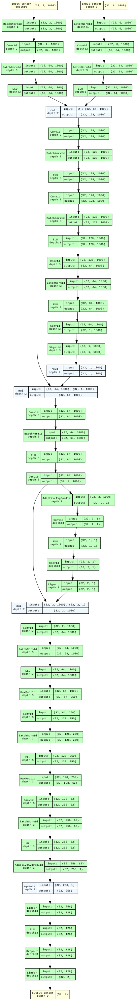
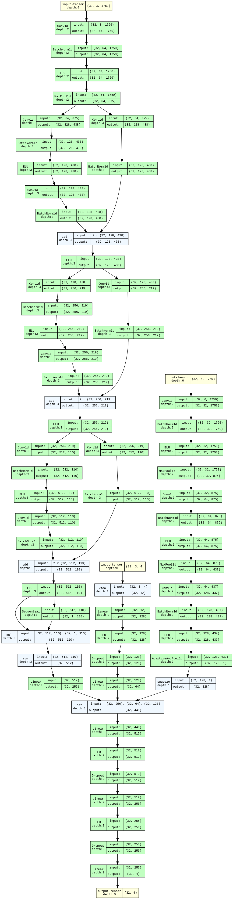

# EEG Classification Pipeline

End-to-end pipeline for Motor Imagery (MI) and Steady-State Visual Evoked Potential (SSVEP) classification using EEG and motion data.

## Table of Contents
- [Repository Structure](#repository-structure)
- [Reproducibility](#reproducibility)
- [Model Architectures](#model-architectures)
- [Data Processing](#data-processing)

## Repository Structure
```
.
├── data_and_model_classes/
│   ├── MI_dataset.py
│   ├── MI_model_arch.py
│   ├── SSVEP_dataset.py
│   ├── SSVEP_model_arch.py
│   └── training_related_functions.py
|
├── mtc-best-weights/
│   ├── mi_model_42.pth
│   ├── ssvep_model_epoch15_f10.6090_loss1.0770.pth
│   └── submission.csv
|
├── scripts/
│   ├── create_csv_submission.py
│   └── train_model.py
|
├── newly_created_submissions/     # created submissions from running scripts/create_csv_submission.py
|
├── README_Data.md
├── README.md
├── requirements.txt

```
## Reproducibility:
To Reproduce our work, do the following:
#### 1. Installing Requirements:
```bash
pip install -r requirements.txt
```
#### 2. Clone the Repository:
```bash
git clone https://github.com/EEG-Data-Processing-MI-and-SSVEP/Online_Round MTC-IAC && cd MTC-AIC
```
#### 3. Create the `.env` file:
```bash
mv .env.example .env
```
#### 4. update the `DATA_BASE_DIR` variable in the `.env`:
```bash
DATA_BASE_PATH=<your_data_path>
```
#### 5. Define the `.env` variable `$DATA_BASE_DIR` as shell variable:
```bash
source .env
```
#### 6. Running scripts you want:
##### 1. For training:
> best  weights are saved under `mtc_best_weights/` directory.
```bash
python scripts/train_model.py \
    --task "MI" \
    --num_epochs 100 \
    --batch_size 64 \
    --train_csv $DATA_BASE_DIR/train.csv
    --validation_csv $DATA_BASE_DIR/validation.csv
```
##### 2. For generating a submission:
> created `.csv` file is saved under `newly_created_submissions/` directory.
```bash
python scripts/create_csv_submission.py \
    --mi_checkpoint_path "mtc_best_weights<path_to_.pth_of_best_mi_wights>"\
    --ssvep_checkpoint_path "mtc_best_weights/<path_to_.pth_of_best_ssvep_wights>"\
    --test_set_csv_path $DATA_BASE_DIR/test.csv
```

## Model Architectures
<div style="display: flex; justify-content: space-around; align-items: center; gap: 20px;">
  <div style="text-align: center; flex: 1; border-right: 1px solid #ddd; padding-right: 20px;">
    <h3>MI Model Architecture</h3>
    
  </div>
  
  <div style="text-align: center; flex: 1;">
    <h3>SSVEP Model Architecture</h3>
    
  </div>
</div>

### 1. Motor Imagery
Under `data_and_model_classes/MI_model_arch.py`


#### Components:
```python
class MotionAwareDenoiser(nn.Module):
    """ICA-inspired denoiser with motion artifact removal"""
    # Architecture details...
    # - EEG and motion processing branches
    # - Temporal convolution layers
    # - Attention mechanism
    # - Reconstruction layer

class SpatialAttentionClassifier(nn.Module):
    """Classifier with spatial attention"""
    # Architecture details...
    # - Spatial attention layer
    # - Temporal feature extraction (3 conv blocks)
    # - Classification head

class EEGPipeline(nn.Module):
    """End-to-end MI classification pipeline"""
    # Combines denoiser and classifier
```

### 2. SSVEP Model 
Under `data_and_model_classes/SSVEP_model_arch.py`

#### Components:
```python
class EnhancedSSVEPModel(nn.Module):
    """Enhanced model with frequency attention"""
    # Architecture details...
    # - EEG branch with residual blocks
    # - Frequency branch for SSVEP features
    # - Motion branch for artifact handling
    # - Attention pooling
    # - Classifier head

class ResidualBlock(nn.Module):
    """Custom 1D residual block"""
    # Implements skip connections

class AttentionPooling(nn.Module):
    """Learnable temporal pooling"""
    # Implements attention-based pooling
```

## Data Processing:
### SSVEP Data Processing

#### Processing Pipeline

1. **EEG Processing**:
   - **Channel Selection**: PO7, OZ, PO8
   - **Notch Filtering**: 50Hz removal
   - **Bandpass Filtering**: 6-30Hz range
   - **Referencing**: Average reference (`set_eeg_reference('average')`)
   - **Normalization**: Channel-wise z-score
   - **Frequency Feature Extraction**:
     - Welch's PSD estimation
     - Power extraction in SSVEP bands:
       - Left: 9-11Hz (10Hz target)
       - Right: 12-14Hz (13Hz target)
       - Forward: 6-8Hz (7Hz target)
       - Backward: 7-9Hz (8Hz target)

2. **Motion Data Processing**:
   - **Channels**: AccX/Y/Z, Gyro1/2/3
   - **Normalization**: Channel-wise z-score
   - **Unit Conversion**: Gyroscope values converted to deg/s

3. **Temporal Processing**:
   - Full trial length: 1750 samples (7s at 250Hz)
   - Output shape: (3 channels × 1750 samples)

#### Implementation (`SSVEPDataset` class)

```python
class SSVEPDataset(Dataset):
    FREQUENCIES = {
        'Left': 10,     # 10Hz stimulation
        'Right': 13,    # 13Hz stimulation  
        'Forward': 7,   # 7Hz stimulation
        'Backward': 8   # 8Hz stimulation
    }
    
    def __getitem__(self, idx):
        # Load and preprocess data:
        # 1. Apply 50Hz notch filter
        # 2. Apply 6-30Hz bandpass
        # 3. Average reference
        # 4. Extract frequency features
        # 5. Normalize all channels
        
        return (
            eeg_tensor,      # (3, 1750) filtered EEG
            freq_tensor,     # (3, 4) frequency features  
            motion_tensor,   # (6, 1750) motion data
            label_tensor     # class label
        )
```
###  Motor Imagery (MI) Data Processing
#### Processing Pipeline

1. **EEG Processing:**

    - **Channel Selection:** C3, C4 (after CAR)
    - **Bandpass Filtering:** 8-30Hz range
    - **Referencing:** Common Average Reference using CZ and PZ
    - **Normalization:** Channel-wise z-score
    - **Temporal Window:** 2-6s (1000 samples)

2. **Motion Data Processing:**

    - **Channels:** AccX/Y/Z, Gyro1/2/3
    - **Unit Conversion:** Gyroscope to deg/s
    - **Normalization:** Channel-wise z-score (optional)
    - **Temporal Window:** 2-6s (1000 samples)


### Implementation (MIDataset class)
```python
class MIDataset(Dataset):
    label_encoding = {'Left': 0, 'Right': 1}
    
    def __getitem__(self, idx):
        # Processing steps:
        # 1. Load C3, CZ, C4, PZ channels
        # 2. Apply 8-30Hz bandpass
        # 3. CAR reference using CZ/PZ
        # 4. Keep only C3/C4
        # 5. Select 2-6s window
        # 6. Normalize
        
        return (
            eeg_tensor,      # (1000, 2) [C3, C4]
            motion_tensor,   # (1000, 6) motion data  
            label_tensor     # class label (0=Left, 1=Right)
        )
```

### Key Differences Between Modalities
| Feature                      | SSVEP                     | Motor Imagery             |
|------------------------------|---------------------------|---------------------------|
| Channels                     | PO7, OZ, PO8              | C3, C4                    |
| Filtering                    | 6-30Hz + 50Hz notch       | 8-30Hz only               |
| Reference                    | Average reference         | CAR (CZ/PZ)               |
| Window                       | Full trial (1750 samples) | 2-6s (1000 samples)       |
| Features                     | Frequency band power      | Raw time-series           |
| Classes                      | 4 directions (Left/Right/Backward/Forward)              | 2 classes (Left/Right)    |

### Common Processing Elements

- **Normalization**: Both use channel-wise z-score normalization  
- **Motion Data**: Both process accelerometer and gyroscope data  
- **Sampling Rate**: 250Hz for both modalities  
- **PyTorch Integration**: Both return ready-to-use tensors  
